# London Police Department

A website for a police department that wishes to gain intelligence on and expose alleged criminals
in the local area by inviting the public to submit investigations into them and advertising their
details online. The website offers log in and log out functionality for users, user submission forms,
allowance for users to edit submissions and the ability to view other user submissions. The main goal
of the website is to advertise dangerous criminals in order to keep London safe. Access to the website
can be found [here](https://london-pd.herokuapp.com/)

This website can be categorised as a B2C website as the London Police Department aims to work in
conjunction with the public to keep London safer. Its purpose is to appeal to those in the community
to come forward with information about crimes that have occured across London in order to help the police
catch criminals. The website is designed in a fluid manner, informing the visitor of the importance of
this need which hopefully will lead to them creating an account to help the London Police Department.

The goals of the website are as follows:

- Informing the public of the need to help the London Police Department.
- Informing the public of dangerous criminals in the London area.
- Providing a visually appealing website.
- Providing information on staying safe in the London area.
- Functional design to create a simple process for visitors to create an account and submit information.

The goals of the consumer are:

- Information on dangerous people in their local area.
- Information on staying safe.
- Access to an up-to-date website.
- A website which allows them to report crimes they have seen committed.
- A simplistic design that creates a hassle-free process to create an account to submit information.

## UX

### Ideal Visitor

This website is aimed at those who:

- Live in and around the London area.
- Have information regarding a crime that has been committed.
- Would like to report a dangerous individual.

Visitors to the website will be looking for:

- A safe and secure way to report crimes.
- Information on staying safe.
- Dangerous individuals in their local area to be wary of.

This project helps the consumer achieve this by:

- Offering users a safe and secure path to creating an account to submit reports.
- Providing a page on tips to staying safe.
- Being able to search for their local areas in the 'Wanted Persons' page in order to track dangerous
  indivduals in their area.

The following images are wireframes from the website. Please click to enlarge.

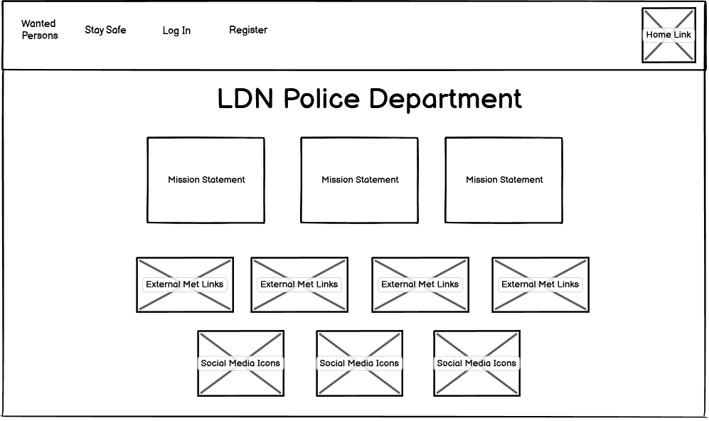
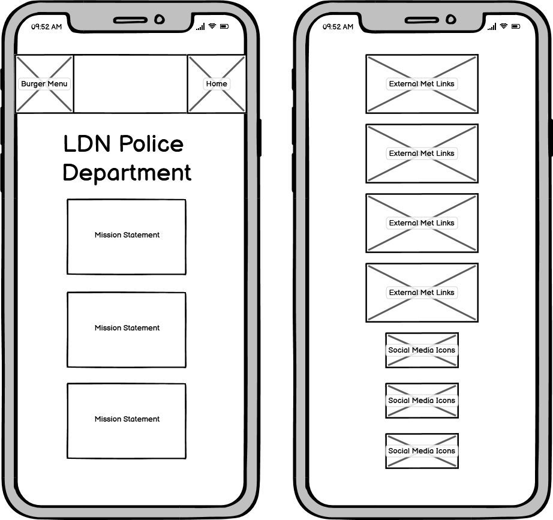
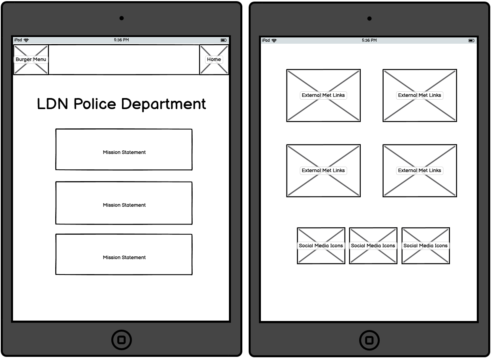
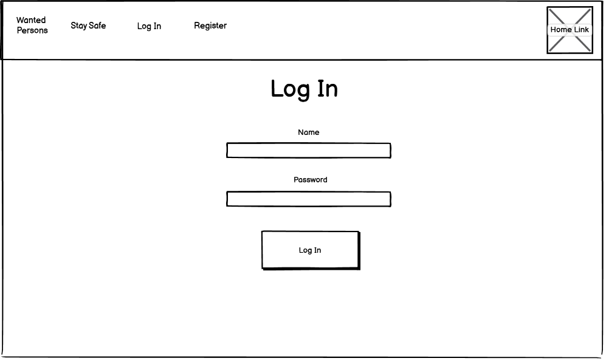
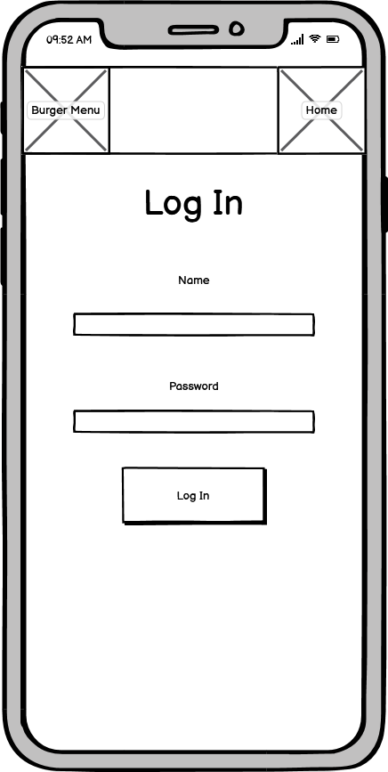
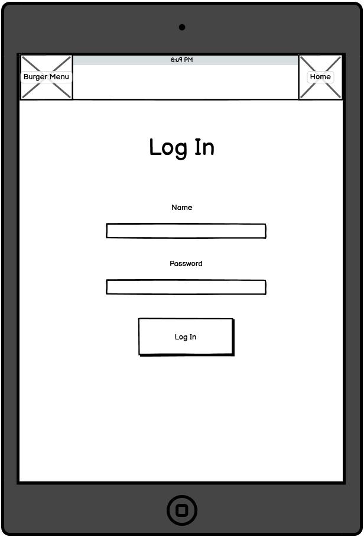
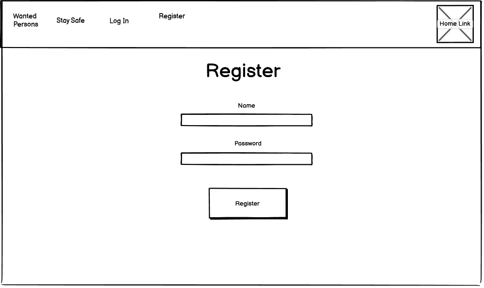
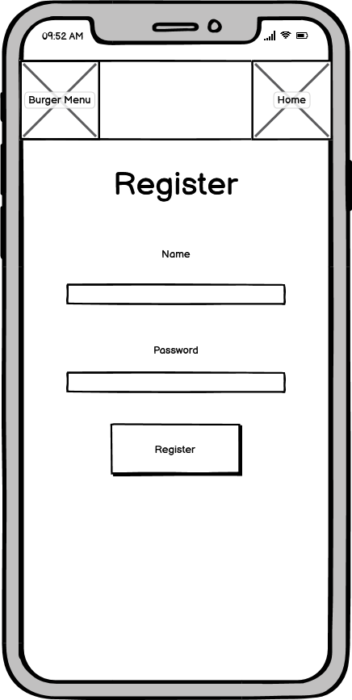
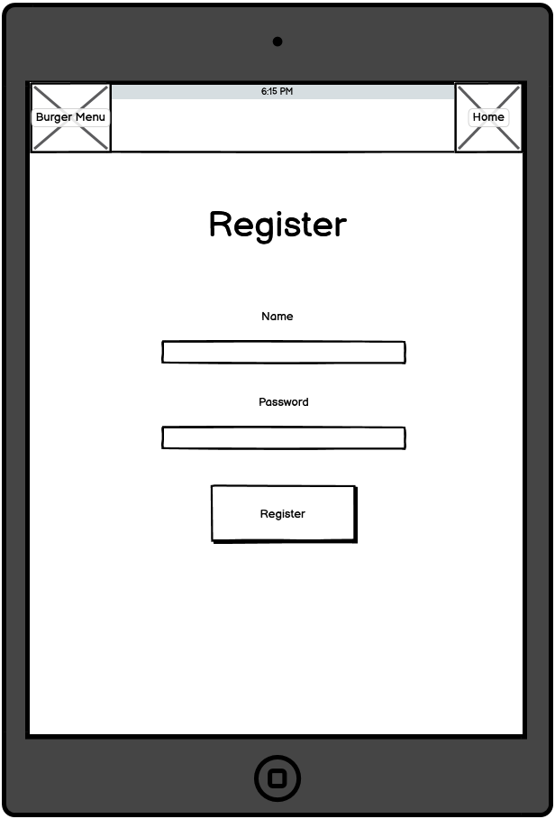
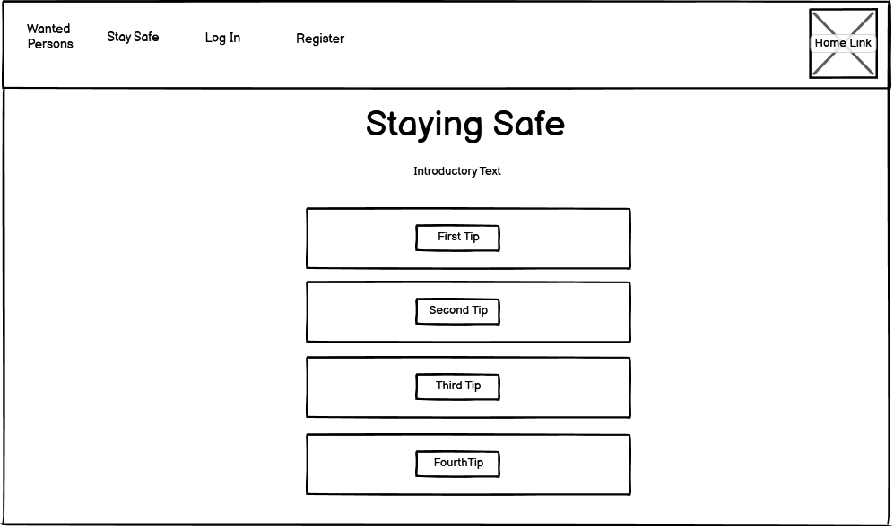
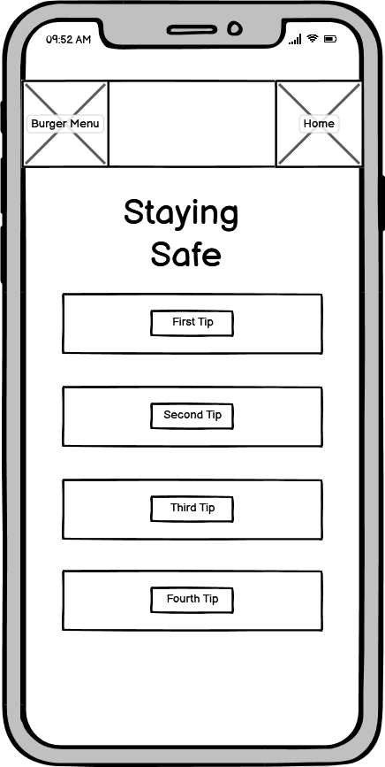
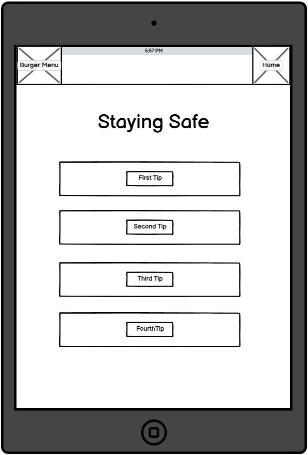
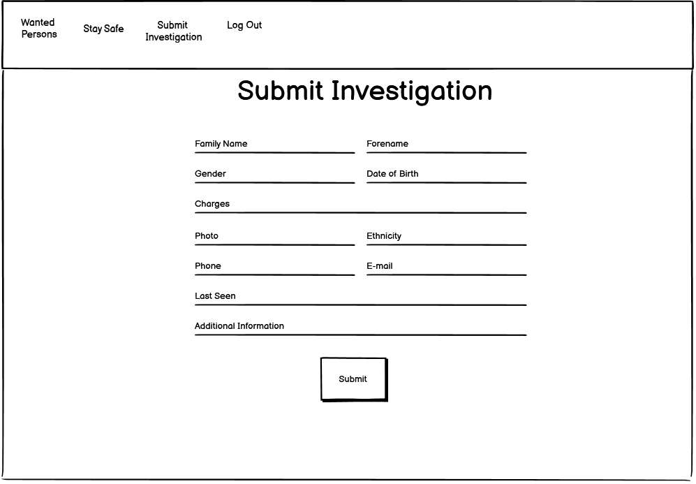
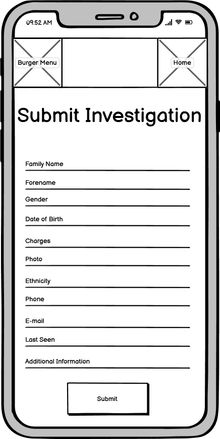
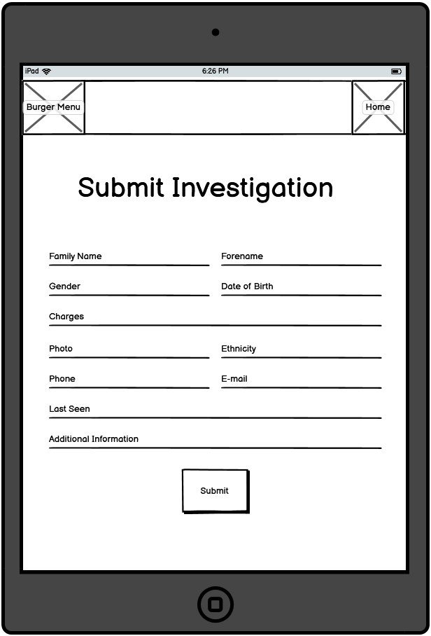
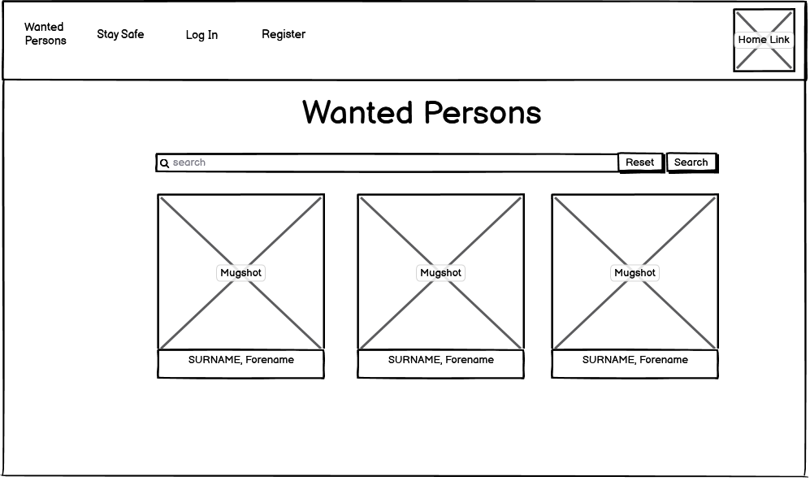
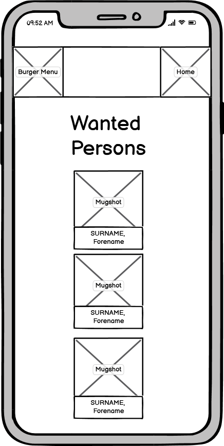
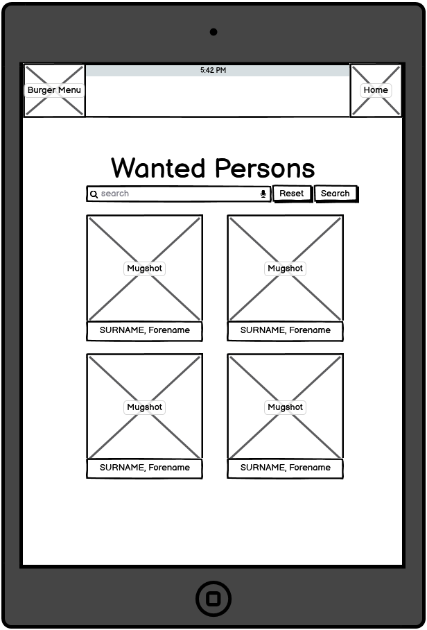

## Client Stories

- As a first-time visitor of the website I want a quick and easy way to see people I need to watch out for.
- As a potential regular user of this website I want to be able to have a secure pathway to submit profiles of
  dangerous individuals as well as having control over my submissions.
- As someone that wants to submit an investigation I want to be contacted upon any updates on the arrest of
  the person I've submitted.

## Features

Each page consisters of a responsive navigation bar with a 'Home' icon in the top right which will redirect users
to the homepage. The navigation bar also links the user to all areas of the website - 'Wanted Persons', 'Stay Safe',
'Log In' and 'Register'. When the user is logged in, the 'Log In', and 'Register' pages are replaced with 'Submit
Investigation' and 'Log Out' links.

### Home

The home page contains a background of the city of London which has the purpose of instantly letting the user know
that this is a London based service. It also displays relevant information to let users understand what the service
provides, how it is provided and how the user can contribute.

There are links to advice pages and social media pages connected to London's Metropolitan Police which is used to
keep users updated on how to stay safe and keep them updated on the goings on in and around London.

### Wanted Persons

'Wanted Persons' consists of a search bar and mugshots of currently wanted people in the London area. This page is
available to users with and without an account. If users do not have an account registered they can have view those
that are currently wanted. This is done to ensure that as many people are informed about dangerous individuals in London.

Each individual profile that has been submitted can be clicked on, revealing the persons family name, suspected offences,
forename, aliases, etc.

If users also want to specifically search for an individual the page has search functionality, where name searches can be
done using the search bar, whilst users with an account registered will have an edit and delete button displayed for the
submissions they have sent in.

### Stay Safe

The 'Stay Safe' page was created to inform users of tips they can implement in their everyday lives to stay safe in their
area. The information displayed was intended to be short and quick to the point in order to provide easy to remember
information.

### Log In

The 'Log In' page is for users that have an account registered. If users without a registered account have misclicked on
this page, a link has been provided underneath the log in function to redirect them to the 'Register' page.

### Register

The 'Register' page is for users that would like to set up an account to submit an investigation now or for the future.
Akin to the 'Log In' page, if users that have a registered account with the website accidentally click here they can be
re-routed to the 'Log In' page.

### Submit Investigation

This page is viewable only for registered users. In this page, registered users can submit profiles of individuals they
want to be tracked and investigated.

This page has form submission functionality where once a user has filled out the form, the profile will be sent straight
to 'Wanted Persons' for every user to be able to see.

### Edit Investigation

This page is for users who have submitted an investigation and would like to edit the information they have given. This page
makes it easy for users to either commit to the changes they've made or cancel them with the 'Cancel' button or the 'Make
Changes' button.

## Future Implementations

- When users try to edit their submissions a modal pops up instead of being redirected to a new page so that the website feels
  more fluid.
- Similar to the deletion modal implemented in the delete area of the website, the same functionality applied to the 'Log Out'
  button.
- Varied page strucutre especially in the home page where social media icons and 'Advice From the Met' links feel too simplistic.

## Technologies Used

- HTML
- CSS
- GitHUB
- Python
- Flask
- Werkzeug
- Heroku
- Google Fonts
- Hover.css
- jQuery
- All images imported were downloaded from Google Images and then stored and linked by the developer.
- MaterializeCSS

## Testing

- [W3C HTML Code Validator](https://validator.w3.org/nu/?doc=https%3A%2F%2Flondon-pd.herokuapp.com%2F)
- W3C CSS Validator:
  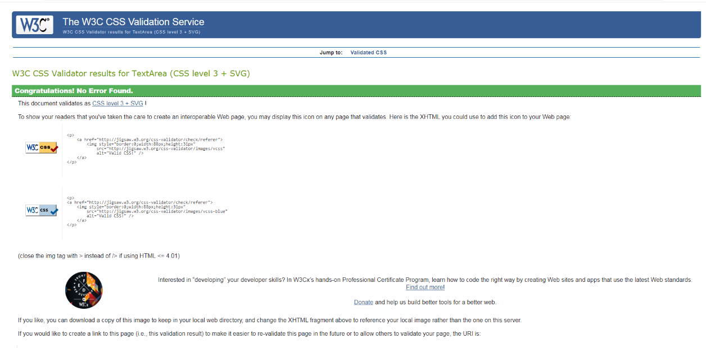

-JSHint:
When using JSHint, there were no errors apart from '\$' being an undefined variable. However this was required to make
the function work.

## Client Stories Testing

The common pathway for users throughout the website would be:

Home > Wanted Persons > Stay Safe

However users with information to submit would likely have this pathway:

Home > Wanted Persons > Register > Submit Investigation > Log Out

## Testing Client Stories

1. As a first-time visitor of the website I want a quick and easy way to see people I need to watch out for.

i. Using a clean and functional navigation bar 'Wanted Persons' is clearly visible to the user, as well as being the
first link on the navigation bar.
ii. With the website's one-page formatting there is a short trip to this page.

2. As a potential regular user of this website I want to be able to have a secure pathway to submit profiles of
   dangerous individuals as well as having control over my submissions.

i. Using the 'Register' page's registration functionality users can create a secure account bolstered with the
use of Werkzeug.

ii. Once registration has been completed, users can submit investigations using the 'Submit Investigation' page.

iii. In future when users have logged in, they can edit and delete their submissions.

3. As someone that wants to submit an investigation I want to be contacted upon any updates on the arrest of
   the person I've submitted.

i. Viewers of wanted people have access to user's email address and telephone number.

## Manual Testing of all elements and functionality on every page

### Home

1. Navigation Bar

i. Clicking the home icon results in sending users to the home page.

ii. Hovering over each link has an underline effect and color changes to a darker shade.

iii. Right click and select “Inspect” to change screen size to that of a mobile device or tablet to confirm that the
navigation bar is responsive.

iv. Clicking each link in the navigation bar sends user to appropriate pages.

v. Adjusting screen size small and medium size screen devices results in navigation bar retreating to a burger menu
with fully functioning links and space for users to click away from the menu.

2. Background Image

i. Change screen size to mobile and tablet devices to ensure the image scales depending on screen size.

3. Card Panels

i. 

4. Links to Metropoliton Police web pages

## Deployment

### How to run this project locally

To access this project on your own IDE, carry out the following, ensure you have an IDE such as [Visual
Studio Code](https://code.visualstudio.com/)

You will also need to have access to the following:

- [PIP](https://pip.pypa.io/en/stable/installing/)
- [Python 3](https://www.python.org/downloads/)
- [Git](https://gist.github.com/derhuerst/1b15ff4652a867391f03)
- An account with [MongoDB](https://www.mongodb.com/)

### Instructions

1. Go to https://github.com/adamkcook94/london_pd.

2. Save a copy of the GitHub repository by clicking on "Code" at the top of the page and from the dropdown
   menu select "Download Zip". If you have downloaded the aforementioned "Git", you can clone the repository
   with the command:

git clone https://github.com/adamkcook94/london_pd

3. If needed, you can upgrade pip with the command:

pip install --upgrade pip.

4. Install the required modules with the command:

pip - requirements.txt.

5. In your IDE, create a file called "env.py".

6. In "env.py" create a "SECRET_KEY" variable and "MONGO_URI" to connect to your database.

7. You can now run the app with the command:

python3 app.py.

## Heroku Deployment

To deploy this project to Heroku, carry out the following:

1. Create a "requirements.txt" file using the following command:

pip freeze > requirements.txt.

2. Create a Procfile with the command:

echo web: python3 app.py > Procfile.

3. Using "git add" and "git commit" prepare the requirements and Procfile, then "git push"
   the project to GitHub.

4. Create a new app with [Heroku](https://www.heroku.com/) firstly by signing up or logging in,
   and selecting "New" on your dashboard.

5. Give it a name and select Europe as your region.

6. From the dashboard, click on "Deploy", then "Deployment method" and select GitHub.

7. Confirm your wish to link the Heroku app to the correct GitHub repository.

8. From the Heroku dashboard, click on "Settings" and then "Reveal Config Vars".

9. Set the following config vars:

- DEBUG = FALSE
- IP = 0.0.0.0
- MONGO_URI = mongodb+srv://<username>:<password>@<cluster_name>-qtxun.mongodb.net/<database_name>?retryWrites=true&w=majority
- PORT = 5000
- SECRET_KEY = <your_secret_key>

10. In the Heroku dashboard click "Deploy"

11. In "Manual Deployment" ensure the master branch has been selected and click "Deploy Branch".

12. The site has now been deployed

## Credits

- Interpol
- Metropolitan Police
